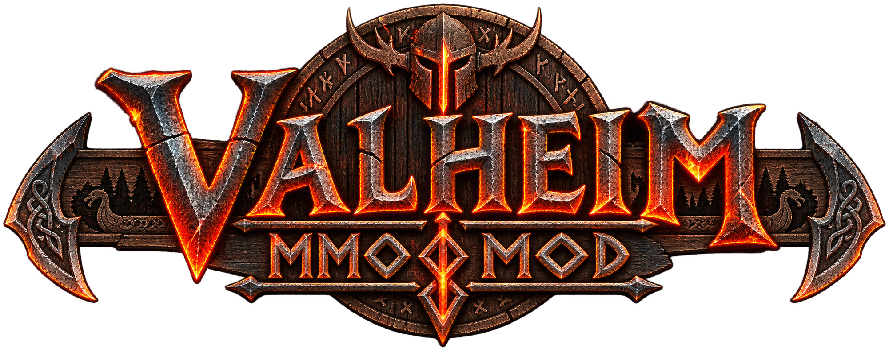

<p align="center">
  
</p>

# Valheim MMO MOD



**Versione 2.5.0** · Mod cooperativa per Valheim con gilde, missioni, economia e mercanti. Funziona anche in giocatore singolo.

## Funzionalità

- **Gilde e amici:** inviti con accettazione, ruoli, tag, esperienza della gilda, richieste di amicizia e blocco delle richieste.
- **Missioni:** tre giornaliere e tre settimanali, con progressi legati a combattimento, raccolta, esplorazione e abilità. Puoi sostituire una giornaliera non completata con un obiettivo più facile, fino a tre cambi al giorno.
- **EXP personale:** ricompense proporzionate all'attività, da riscuotere a missione completata. È separata dalle abilità native di Valheim.
- **Economia:** saldo oro, deposito e prelievo di monete, trasferimenti e storico dei movimenti.
- **Viandante:** mercante accompagnato da due guardie, con risorse acquistabili in oro.
- **Borgo:** botteghe di cibo, attrezzi, armi e armature iniziali, con edifici in legno e decorazioni.
- **Esplorazione:** destinazioni casuali persistenti nei Prati, lontano dallo spawn iniziale; mercanti e borgo hanno segnaposti sulla mappa e vengono creati quando si carica la zona.
- **Interfaccia:** pannelli e font del gioco, logo personalizzato e guida accessibile dal menu principale.

## Requisiti

- Una copia di Valheim e BepInEx 5 installato per Valheim.
- Ambiente verificato: **Windows, Valheim 1.0.15, BepInEx 5.4.23.5**. Altre versioni non sono state verificate.
- In multiplayer, **host/server e tutti i giocatori devono installare la stessa versione della mod**. In singolo il gioco locale svolge il ruolo di host.

## Installazione

1. Chiudi Valheim e fai una copia dei salvataggi del mondo e dei dati della mod se stai aggiornando.
2. Estrai questo archivio.
3. Copia la cartella `BepInEx` contenuta nel pacchetto nella cartella principale di Valheim.
4. Se esiste già una vecchia `ValheimMMOMOD.dll` in un'altra sottocartella di `BepInEx/plugins`, spostala fuori dalla cartella dei plugin: deve essere caricata **una sola copia**.
5. Avvia il gioco. Nel menu principale compare **Guida MMO MOD**, tradotta nella lingua selezionata.

Il file da installare è `BepInEx/plugins/ValheimMMOMOD/ValheimMMOMOD.dll`. Logo e traduzioni sono incorporati nella DLL: non occorre installare i sorgenti o la cartella `assets`.

BepInEx e le librerie proprietarie di Valheim non sono inclusi nel pacchetto.

## Comandi e utilizzo

| Comando | Funzione |
| --- | --- |
| **F10** | Apre o chiude gilde, economia, missioni, amici e mappa |
| **Esc** | Chiude il pannello o la bottega |
| **M** | Apre la mappa del gioco, con i segnaposti dei mercanti |
| **E**, vicino al mercante | Apre il negozio di quel venditore |

M ed E indicano i comandi predefiniti di Valheim. I negozi si aprono esclusivamente sul posto, non da F10, e si chiudono oltre sei metri dal venditore. Usano il saldo oro della mod: deposita le monete fisiche prima di acquistare.

Le missioni giornaliere si rinnovano alle 00:00 UTC; quelle settimanali il lunedì alle 00:00 UTC. Cambiare una missione azzera i suoi progressi e riduce il premio in oro. Premi **Riscatta** per ottenere la ricompensa.

Comandi chat disponibili, uguali in tutte le lingue:

```text
/mmomod
/creagilda nome
/invitagilda nome
/escigilda
/gildatag TAG
/condividimappa
/saldo
/dai nome quantità
/ritira quantità
/deposita
/quest
/completaquest
```

## Lingue

L'interfaccia segue la lingua scelta nelle impostazioni di Valheim: guida, pannelli, missioni, negozi e messaggi. I nomi degli oggetti provengono dalle traduzioni native del gioco. I nomi scelti dai giocatori non vengono tradotti; i messaggi del server sono resi nella lingua del destinatario.

Sono inclusi 35 cataloghi: italiano, inglese, svedese, francese, tedesco, spagnolo, russo, rumeno, bulgaro, macedone, finlandese, danese, norvegese, islandese, turco, lituano, ceco, ungherese, slovacco, polacco, olandese, portoghese europeo e brasiliano, cinese semplificato e tradizionale, giapponese, coreano, hindi, thai, croato, georgiano, greco, serbo, ucraino e lettone.

**Abenaki e lingue senza un catalogo dedicato usano l'inglese come riserva.** Le traduzioni non italiane sono state generate automaticamente e corrette in parte: sono benvenute revisioni linguistiche. Il gioco non contatta servizi di traduzione durante l'uso.

## Configurazione e dati

Il primo avvio genera `BepInEx/config/antonio.valheim.mmomod.cfg`. L'host può abilitare o disabilitare economia, missioni, viandante e villaggio e regolare premi e limite membri. Sono disponibili anche opzioni di condivisione della mappa e visualizzazione dei tag.

Dati della mod:

- `BepInEx/config/MMOMOD/world_<uid>_v2.json`: stato separato per mondo e personaggio.
- `BepInEx/config/MMOMOD/journal_<world>_<character>.json`: registro locale delle consegne e operazioni.

Conserva questa cartella insieme ai backup di mondo e personaggio. I dati della mod sono distinti dai salvataggi Steam. Il sistema è pensato per gruppi cooperativi con client fidati, non come protezione anticheat. Evita chiusure forzate durante acquisti, depositi e prelievi.

## Sorgenti e compilazione

Il pacchetto contiene anche `src`, `assets`, `tests` e il progetto .NET. Servono .NET SDK 9 e i riferimenti di compilazione .NET Framework 4.8, oltre alle librerie presenti nell'installazione locale di Valheim/BepInEx.

Dalla cartella del progetto, in PowerShell:

```powershell
$env:ValheimDir = 'D:\SteamLibrary\steamapps\common\Valheim'
dotnet build .\ValheimMMOMOD.csproj -c Release
dotnet run --project .\tests\DomainTests.csproj -c Release
```

Sostituisci il percorso di esempio con la tua installazione. La nuova DLL viene generata in `build/ValheimMMOMOD.dll`. I test richiedono anche gli asset dell'installazione per verificare i nomi dei prefab.

## Stato delle verifiche

La 2.5.0 ha superato la compilazione senza errori o avvisi e **157 controlli automatici**, inclusi copertura dei cataloghi, conservazione dei valori nelle traduzioni, messaggi e regole di gioco. Il caricamento della mod con lingua francese è stato confermato dai log. La verifica visiva finale della 2.5.0 è stata interrotta e non è dichiarata completata; i test non sostituiscono una prova multiplayer o una revisione umana di tutte le lingue.

## Pubblicazione su GitHub

Per mostrare questo README nella pagina del repository, carica **i file estratti** nella radice del repository. Puoi allegare il `.rar` a una GitHub Release per il download completo. Caricare soltanto il RAR non rende visibili README e sorgenti nella pagina principale.

Non sono inclusi salvataggi, configurazioni personali, log, backup o librerie del gioco. Prima di distribuire aggiornamenti, aggiorna il numero di versione e ricompila la DLL.

## Attribuzioni e licenza

Progetto non ufficiale e non affiliato agli autori di Valheim. Gli elementi nativi dell'interfaccia e i modelli sono richiamati dall'installazione del gioco. Il logo personalizzato è incluso nel pacchetto.

Non è stata assegnata una licenza open source a questo progetto: la pubblicazione del codice non concede automaticamente permessi di riutilizzo. Il titolare potrà aggiungere un file `LICENSE` con le condizioni desiderate.
